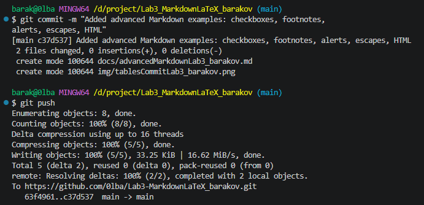

# Работа с Markdown-разметкой и базовое использование LaTeX в документации проекта
---
##  Краткое описание
В ходе лабораторной работы были изучены основы языка разметки Markdown и базовые возможности LaTeX для оформления документации. Освоены заголовки, списки, таблицы, ссылки, изображения, блоки кода, цитаты, чекбоксы, сноски, alert-блоки и математические формулы.
## Содержание
- [Структура проекта](#структура-проекта)
---
## Структура проекта
1. **docs/** - Markdown-файлы с примерами разметки
  - `headersLab3_barakov.md` - заголовки
  - `separatorsLab3_barakov.md` - горизонтальные линии
  - `formattingLab3_barakov.md` - форматирование текста
  - `listsLab3_barakov.md` - списки
  - `linksImagesLab3_barakov.md` - ссылки и изображения
  - `codeQuotesLab3_barakov.md` - блоки кода и цитаты
  - `tablesLab3_barakov.md` - таблицы
  - `advancedMarkdownLab3_barakov.md` - расширенные возможности
  - `latexLab3_barakov.md` - примеры LaTeX
2. **img/** - скриншоты выполнения заданий
  - `gitPushLab3_barakov.png`
  - `commitStructureLab3_barakov.png`
  - `headersCommitLab3_barakov.png`
  - `separatorsCommitLab3_barakov.png`
  - `formattingCommitLab3_barakov.png`
  - `listsCommitLab3_barakov.png`
  - `linksCommitLab3_barakov.png`
  - `codeCommitLab3_barakov.png`
  - `tablesCommitLab3_barakov.png`
  - `advancedMarkdownCommitLab3_barakov.png`
  - `latexCommitLab3_barakov.png`
  - `readmeFinalPushLab3_barakov.png`
3. **latex/**
4. `README.md` - основной файл документации
---
## Примеры:
### 1. Заголовки (H1–H3)
- # AAA  
- ## AAA  
- ## AAA  
---
### 2. Горизонтальная линия
---
---
### 3. Форматирование текста
- **полужирный**
- *курсив*
- ~~зачёркнутый~~
- `моноширный`
---
### 4. Списки
- маркированный
1. нумерованный
1. вложенный
    - 123
---
### 5. Цитата
> Привет
---
### 6. Блок кода
```csharp
string q;
console.writeline("Как тебя зовут?")
q = Console.ReadLine();
Console.WriteLine(q);
```
---
### 7. Таблица
|1|2|3|
|:-|:-:|-:|
|3333|22222|11111|
---
### 8. Изображение из папки img/

---
### 9. Ссылка
[dns](https://www.dns-shop.ru/)
[dns](https://www.dns-shop.ru/ "перейти")
---
### 10.
- [ ] Task 1
- [x] Task 2
---
### 11. 
Markdown полезен в разработке[^1].

[^1]: Примечание: Markdown широко используется для оформления документации, README-файлов и заметок.
---
### 12. Alert-блоки GitHub
>[!NOTE]
>123.
> [!TIP]
> 321
> [!WARNING]
> 321
---
### 13. Inline LaTeX
$a = b + 7^3$
---
### 14. Block LaTeX
$$
\prod_{k=1}^n k
$$